# Enhanced Prediction Panel with Forward Pass Visualization

## Overview

The prediction tab has been completely redesigned to provide a more compact and informative interface with live forward pass visualization. The new design features a split-panel layout with condensed controls on the left and a comprehensive forward pass visualizer on the right.

## Key Features

### 🎯 **Condensed Left Panel**
- **Compact Model Selection**: Streamlined model selection with refresh buttons
- **Efficient Data Controls**: Simplified data file selection with current data option
- **Action Buttons**: Icon-based buttons for prediction, results, clear, and settings
- **Status Display**: Real-time status and progress information

### 📊 **Right Panel - Forward Pass Visualizer**
- **Live Weights Evolution**: Real-time visualization of neural network weights
- **Bias Tracking**: Dynamic bias value evolution during prediction
- **Prediction vs Input Plot**: Scatter plot showing prediction relationships
- **Live Animation**: Toggle-able real-time updates
- **Information Display**: Current step count, latest prediction, and model info

## Architecture

### Components

1. **Enhanced Prediction Panel** (`prediction_panel.py`)
   - Split layout with left controls and right visualizer
   - Integrated forward pass visualization
   - Compact, efficient interface design

2. **Forward Pass Visualizer** (`forward_pass_visualizer.py`)
   - Three-panel matplotlib visualization
   - Real-time data updates
   - Thread-safe animation system
   - Configurable display options

3. **Updated Prediction Integration** (`prediction_integration.py`)
   - Forward pass data extraction
   - Batch processing with visualization callbacks
   - Support for multiple model types (basic, advanced, Keras)

### Data Flow

```mermaid
sequenceDiagram
    participant User
    participant PredictionPanel
    participant ForwardPassVisualizer
    participant PredictionIntegration
    participant NeuralNetwork

    User->>PredictionPanel: Click "🚀 Predict"
    PredictionPanel->>ForwardPassVisualizer: start_prediction_mode()
    PredictionPanel->>PredictionIntegration: start_prediction(params, callback)
    
    loop For Each Batch
        PredictionIntegration->>NeuralNetwork: predict(batch)
        NeuralNetwork-->>PredictionIntegration: predictions, weights, bias
        PredictionIntegration->>PredictionPanel: on_prediction_progress(weights, bias, prediction, input, progress)
        PredictionPanel->>ForwardPassVisualizer: add_forward_pass_data()
        ForwardPassVisualizer->>ForwardPassVisualizer: update_visualization()
    end
    
    PredictionIntegration->>PredictionPanel: prediction_completed()
    PredictionPanel->>ForwardPassVisualizer: stop_prediction_mode()
```



## Visualizer Components

### 1. **Weights Evolution Plot**
- **Purpose**: Shows how neural network weights change during prediction
- **Display**: Line plot with multiple weight dimensions
- **Features**: 
  - Color-coded weight dimensions
  - Real-time updates
  - Legend for multiple weights

### 2. **Bias Evolution Plot**
- **Purpose**: Tracks bias value changes during prediction
- **Display**: Single line plot
- **Features**:
  - Real-time bias tracking
  - Smooth animation updates

### 3. **Prediction vs Input Plot**
- **Purpose**: Shows relationship between input values and predictions
- **Display**: Scatter plot with trend line
- **Features**:
  - Dynamic point addition
  - Trend line calculation
  - Input-prediction correlation

## Usage Instructions

### Basic Prediction
1. **Select Model**: Choose a trained model from the dropdown
2. **Select Data**: Choose prediction data file or use current data
3. **Start Prediction**: Click "🚀 Predict" button
4. **Watch Visualization**: Observe live forward pass in the right panel

### Advanced Features
1. **Live Animation**: Toggle "Live Animation" checkbox for real-time updates
2. **Settings**: Click "⚙️ Settings" to configure batch size and confidence
3. **Clear Results**: Click "🗑️ Clear" to reset visualization
4. **View Results**: Click "📊 Results" to see final predictions

### Visualization Controls
- **Animation Toggle**: Enable/disable live updates
- **Clear Button**: Reset all visualization data
- **Info Display**: Shows current statistics and progress

## Technical Implementation

### Forward Pass Data Extraction

```python
def _extract_model_parameters(self, model, model_type):
    """Extract weights and bias from different model types."""
    if model_type == 'keras':
        # Extract from Keras model layers
        first_layer = model.layers[0]
        weights = first_layer.get_weights()[0]
        bias = first_layer.get_weights()[1]
    elif model_type == 'advanced':
        # Extract from advanced model
        weights = model.weights
        bias = model.bias
    else:
        # Extract from basic StockNet
        weights = model.weights
        bias = model.bias
    return weights, bias
```

### Batch Processing with Visualization

```python
def _predict_with_visualization(self, model, X, feature_info, progress_callback, 
                              model_type='basic', integration=None, original_X=None):
    """Process predictions in batches with visualization updates."""
    for i in range(0, total_samples, batch_size):
        # Make prediction for batch
        batch_predictions = model.predict(X_batch)
        
        # Extract model parameters
        weights, bias = self._extract_model_parameters(model, model_type)
        
        # Call progress callback with visualization data
        if progress_callback:
            progress_callback(weights, bias, sample_prediction, sample_input, progress)
```

### Thread-Safe Visualization Updates

```python
def add_forward_pass_data(self, weights, bias, prediction, input_data):
    """Add new data to visualization with thread safety."""
    # Add to history (thread-safe deque)
    self.weights_history.append(weights)
    self.bias_history.append(bias)
    self.prediction_history.append(prediction)
    self.input_history.append(input_data)
    
    # Update immediately if animation is off
    if not self.animation_var.get():
        self.update_visualization()
```

## Benefits

### 🎯 **Improved User Experience**
- **Compact Interface**: More efficient use of screen space
- **Visual Feedback**: Real-time insight into model behavior
- **Intuitive Controls**: Icon-based buttons and clear labeling

### 📊 **Enhanced Understanding**
- **Model Transparency**: See how weights and bias affect predictions
- **Learning Insights**: Understand neural network decision-making
- **Debugging Capability**: Identify potential model issues

### ⚡ **Performance Features**
- **Batch Processing**: Efficient handling of large datasets
- **Thread-Safe Updates**: Smooth visualization without blocking
- **Memory Management**: Limited history to prevent memory issues

## Configuration Options

### Prediction Settings
- **Batch Size**: Configure processing batch size (default: 32)
- **Confidence Threshold**: Set prediction confidence level (default: 0.8)

### Visualization Settings
- **History Length**: Maximum number of data points to display (default: 100)
- **Update Frequency**: Animation update rate (default: 100ms)
- **Display Options**: Toggle individual plot visibility

## Testing

Run the test script to verify functionality:

```bash
python test_enhanced_prediction_panel.py
```

The test includes:
- Forward pass visualizer component testing
- Full prediction panel integration testing
- Mock prediction simulation
- Sample data generation

## Future Enhancements

### Planned Features
1. **3D Weight Visualization**: 3D plots for complex weight matrices
2. **Gradient Flow**: Show gradient information during prediction
3. **Attention Visualization**: For attention-based models
4. **Export Capabilities**: Save visualization as images/videos
5. **Custom Plot Types**: User-configurable visualization layouts

### Performance Optimizations
1. **GPU Acceleration**: Use GPU for large-scale visualizations
2. **Data Compression**: Efficient storage of historical data
3. **Async Updates**: Non-blocking visualization updates
4. **Memory Pooling**: Optimized memory management

## Integration with Existing System

The enhanced prediction panel seamlessly integrates with the existing stock prediction GUI:

- **Compatible**: Works with all existing model types
- **Backward Compatible**: Maintains existing prediction functionality
- **Extensible**: Easy to add new visualization types
- **Maintainable**: Clean, modular code structure

## Conclusion

The enhanced prediction panel provides a significant improvement in user experience and model understanding. The live forward pass visualization offers unprecedented insight into neural network behavior during prediction, making the system more transparent and educational for users.

The compact design maximizes screen real estate while providing comprehensive functionality, and the modular architecture ensures easy maintenance and future enhancements. 