# Stock Prediction GUI - Sequence Diagram

## Application Flow Overview

```mermaid
sequenceDiagram
    participant User
    participant MainWindow
    participant StockPredictionApp
    participant DataManager
    participant TrainingIntegration
    participant TrainingPanel
    participant ModelManager
    participant PredictionIntegration
    participant ResultsPanel

    Note over User,ResultsPanel: Application Startup Flow
    User->>MainWindow: Launch GUI
    MainWindow->>StockPredictionApp: Create App Instance
    StockPredictionApp->>DataManager: Initialize Data Manager
    StockPredictionApp->>ModelManager: Initialize Model Manager
    StockPredictionApp->>TrainingIntegration: Initialize Training Integration
    StockPredictionApp->>PredictionIntegration: Initialize Prediction Integration
    StockPredictionApp->>MainWindow: Setup Main Window
    MainWindow->>TrainingPanel: Create Training Panel
    MainWindow->>ResultsPanel: Create Results Panel
    MainWindow-->>User: GUI Ready

    Note over User,ResultsPanel: Data Loading Flow
    User->>MainWindow: Load Data File
    MainWindow->>StockPredictionApp: load_data_file()
    StockPredictionApp->>DataManager: load_data()
    DataManager-->>StockPredictionApp: Data Loaded Successfully
    StockPredictionApp->>MainWindow: update_data_info()
    MainWindow->>TrainingPanel: Update Data Info
    MainWindow-->>User: Data Loaded

    Note over User,ResultsPanel: Feature Selection Flow
    User->>MainWindow: Select Features & Target
    MainWindow->>StockPredictionApp: set_selected_features()
    MainWindow->>StockPredictionApp: set_selected_target()
    StockPredictionApp->>TrainingPanel: Update Feature Selectors
    MainWindow-->>User: Features Locked

    Note over User,ResultsPanel: Training Flow
    User->>TrainingPanel: Click "Start Training"
    TrainingPanel->>StockPredictionApp: start_training(params)
    StockPredictionApp->>TrainingIntegration: start_training()
    TrainingIntegration->>TrainingPanel: Initialize Training State
    TrainingPanel->>TrainingPanel: start_live_plotting()
    
    Note over TrainingIntegration,TrainingPanel: Training Progress Loop
    loop Training Epochs
        TrainingIntegration->>TrainingPanel: update_progress(epoch, loss, val_loss, progress)
        TrainingPanel->>TrainingPanel: add_data_point()
        TrainingPanel->>TrainingPanel: update_plot()
        TrainingPanel->>TrainingPanel: live_plotting_loop()
    end

    Note over TrainingIntegration,TrainingPanel: Training Completion
    TrainingIntegration->>StockPredictionApp: _on_training_completed(model_dir)
    StockPredictionApp->>MainWindow: training_completed()
    MainWindow->>TrainingPanel: reset_training_state()
    TrainingPanel->>TrainingPanel: stop_live_plotting()
    TrainingPanel->>TrainingPanel: _force_panel_repaint()
    
    Note over MainWindow,TrainingPanel: Repaint System (NEW)
    MainWindow->>MainWindow: force_complete_repaint()
    MainWindow->>MainWindow: _repaint_all_tabs()
    MainWindow->>MainWindow: _repaint_all_canvases()
    MainWindow->>StockPredictionApp: refresh_models_and_select_latest()
    StockPredictionApp->>ModelManager: refresh_models()
    ModelManager-->>StockPredictionApp: Updated Model List
    StockPredictionApp->>MainWindow: update_model_list()
    MainWindow-->>User: Training Completed - GUI Repainted

    Note over User,ResultsPanel: Prediction Flow
    User->>MainWindow: Select Model & Make Prediction
    MainWindow->>StockPredictionApp: start_prediction(params)
    StockPredictionApp->>PredictionIntegration: start_prediction()
    PredictionIntegration->>ResultsPanel: prediction_completed()
    ResultsPanel-->>User: Prediction Results Displayed

    Note over User,ResultsPanel: Manual Repaint (Emergency)
    User->>TrainingPanel: Click "🔄 Repaint" Button
    TrainingPanel->>TrainingPanel: manual_repaint()
    TrainingPanel->>TrainingPanel: _force_panel_repaint()
    TrainingPanel-->>User: GUI Repainted
```

## Detailed Training Flow with Repaint System

## Emergency Repaint Flow

```mermaid
sequenceDiagram
    participant User
    participant TrainingPanel
    participant MainWindow
    participant StockPredictionApp
    participant MatplotlibCanvas

    Note over User,MatplotlibCanvas: Manual Repaint Trigger
    User->>TrainingPanel: Click "🔄 Repaint" Button
    TrainingPanel->>TrainingPanel: manual_repaint()
    TrainingPanel->>TrainingPanel: _force_panel_repaint()
    
    Note over TrainingPanel,MatplotlibCanvas: Aggressive Panel Repaint
    TrainingPanel->>TrainingPanel: frame.update_idletasks()
    TrainingPanel->>TrainingPanel: frame.update()
    
    loop For Each Child Widget
        TrainingPanel->>TrainingPanel: child.update_idletasks()
        TrainingPanel->>TrainingPanel: child.update()
    end
    
    TrainingPanel->>MatplotlibCanvas: canvas.draw()
    TrainingPanel->>MatplotlibCanvas: canvas.flush_events()
    TrainingPanel->>MainWindow: parent.update_idletasks()
    TrainingPanel->>MainWindow: parent.update()
    TrainingPanel->>MainWindow: root.update_idletasks()
    TrainingPanel->>MainWindow: root.update()
    
    TrainingPanel-->>User: Panel Repainted

    Note over User,MatplotlibCanvas: Emergency App-Level Repaint
    alt Emergency Repaint Needed
        StockPredictionApp->>StockPredictionApp: emergency_repaint()
        StockPredictionApp->>MainWindow: root.update_idletasks()
        StockPredictionApp->>MainWindow: root.update()
        StockPredictionApp->>MainWindow: force_complete_repaint()
        MainWindow->>MainWindow: _repaint_all_tabs()
        MainWindow->>MainWindow: _repaint_all_canvases()
        StockPredictionApp-->>User: Complete GUI Repainted
    end
```

## Data Flow Architecture

## Key Components and Their Responsibilities

### **GUI Layer**
- **MainWindow**: Main application window, tab management, global repaint coordination
- **TrainingPanel**: Training interface, live plotting, manual repaint controls
- **DataPanel**: Data loading and feature selection
- **PredictionPanel**: Model selection and prediction interface
- **ResultsPanel**: Results display and visualization

### **App Layer**
- **StockPredictionApp**: Application coordinator, business logic, event handling
- **DataManager**: Data loading, validation, and preprocessing
- **ModelManager**: Model management and selection
- **FileUtils**: File operations and history management

### **Integration Layer**
- **TrainingIntegration**: Training process coordination, progress callbacks
- **PredictionIntegration**: Prediction process coordination
- **Validation**: Parameter validation and error handling

### **Core Layer**
- **Neural Network Models**: StockNet, AdvancedStockNet
- **Data Processing**: Feature engineering, normalization
- **Visualization**: Matplotlib plotting, 3D animations

## Repaint System Architecture

### **Multi-Level Repaint Strategy**
1. **Panel Level**: Individual panel repaints (TrainingPanel, DataPanel, etc.)
2. **Window Level**: Main window repaint coordination
3. **App Level**: Application-wide repaint coordination
4. **Emergency Level**: Aggressive repaint for critical situations

### **Repaint Triggers**
- **Automatic**: After training completion, model updates, data changes
- **Manual**: User clicks "🔄 Repaint" button
- **Emergency**: System detects GUI issues or blank screens

### **Repaint Components**
- **Tkinter Widgets**: `update_idletasks()`, `update()`
- **Matplotlib Canvases**: `draw()`, `flush_events()`
- **Tab Management**: Individual tab repaints
- **Status Updates**: Status bar and progress indicators

This sequence diagram shows the comprehensive flow of the stock_prediction_gui application, including the new repaint system that ensures the GUI remains functional and visible throughout all operations. 